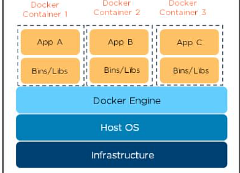

# :sparkles: 26.6.23 :sparkles: 
# :shipit:
# Container
Merkmale 

Container teilen sich Ressourcen mit dem Host-Betriebssystem
Container können im Bruchteil einer Sekunde gestartet und gestoppt werden
Anwendungen, die in Containern laufen, verursachen wenig bis gar keinen Overhead
Container sind portierbar --> Fertig mit "Aber bei mir auf dem Rechner lief es doch!"
Container sind leichtgewichtig, d.h. es können dutzende parallel betrieben werden.
Container sind "Cloud-ready"!

---------------------- 
Wir benutzen dafür jetzt zum testen docker

Docker ist eine Open-Source-Plattform, die es Entwicklern ermöglicht, Anwendungen in isolierten und portablen Containern zu erstellen, bereitzustellen und auszuführen.

---
Umgebungs variablen:
```bash
Anweisungen im Dockerfile 


FROM

Welches Base Image von hub.docker.com verwendet werden soll, z.B. ubuntu:16.04


ADD

Kopiert Dateien aus dem Build Context oder von URLs in das Image.


CMD

Führt die angegebene Anweisung aus, wenn der Container gestartet wurde. Ist auch ein ENTRYPOINT definiert, wird die Anweisung als Argument für ENTRYPOINT verwendet.


COPY

Wird verwendet, um Dateien aus dem Build Context in das Image zu kopieren. Es gibt die zwei Formen COPY src dest und COPY ["src", "dest"]. Das JSON-Array-Format ist notwendig, wenn die Pfade Leerzeichen enthalten.


ENTRYPOINT

Legt eine ausführbare Datei (und Standardargumente) fest, die beim Start des Containers laufen soll.
Jegliche CMD-Anweisungen oder an docker run nach dem Imagenamen übergebenen Argumente werden als Parameter an das Executable durchgereicht.
ENTRYPOINT-Anweisungen werden häufig genutzt, um "Start-Scripts" anzustossen, die Variablen und Services initialisieren, bevor andere übergebene Argumente ausgewertet werden.


ENV

Setzt Umgebungsvariablen im Image.


EXPOSE

Erklärt Docker, dass der Container einen Prozess enthält, der an dem oder den angegebenen Port(s) lauscht.


HEALTHCHECK

Die Docker Engine prüft regelmässig den Status der Anwendung im Container.

    HEALTHCHECK --interval=5m --timeout=3s \ CMD curl -f http://localhost/ || exit 1`


MAINTAINER

Setzt die "Autor-Metadaten" des Image auf den angegebenen Wert.


RUN

Führt die angegebene Anweisung im Container aus und bestätigt das Ergebnis.


SHELL

Die Anweisung SHELL erlaubt es seit Docker 1.12, die Shell für den folgenden RUN-Befehl zu setzten. So ist es möglich, dass nun auch direkt bash, zsh oder Powershell-Befehle in einem Dockerfile genutzt werden können.


USER

Setzt den Benutzer (über Name oder UID), der in folgenden RUN-, CMD- oder ENTRYPOINT-Anweisungen genutzt werden soll.


VOLUME

Deklariert die angegebene Datei oder das Verzeichnis als Volume. Besteht die Datei oder das Verzeichnis schon im Image, wird sie bzw. es in das Volume kopiert, wenn der Container gestartet wird.


WORKDIR

Setzt das Arbeitsverzeichnis für alle folgenden RUN-, CMD-, ENTRYPOINT-, ADD oder COPY-Anweisungen.
```
Netzwerkplan:


Schichtenmodell:

Jede Anweisung in einem Dockerfile führt zu einer neuen Imageschicht – einem Layer –, die wieder zum Starten eines neuen Containers genutzt werden kann.
Die neue Schicht wird erzeugt, indem ein Container mit dem Image der vorherigen Schicht gestartet, dann die Dockerfile-Anweisung ausgeführt und schliesslich ein neues Image gespeichert wird.
Ist eine Dockerfile-Anweisung erfolgreich abgeschlossen worden, wird der temporär erzeugte Container wieder gelöscht. 


---------
ICH WAR AM KÄMPFEN MIT DEM DOCKERDESKTOP WEGENN DERN HYPER-V

schlussendlich habe ich das Problem gelöst in dem das ich das auf der Virtuelle machine des vagrant drauf getan habe

---
Installation:
 

Befehle:


```bash
Standard-Test:

    $ docker run hello-world


Startet einen Container mit einer interaktiven Shell (interactive, tty):

    $ docker run -it ubuntu /bin/bash


Startet einen Container, der im Hintergrund (detach) läuft:

    $ docker run -d ubuntu sleep 20


Startet einen Container im Hintergrund und löscht (remove) diesen nach Beendigung des Jobs:

    $ docker run -d --rm ubuntu sleep 20


Startet einen Container im Hintergrund und legt eine Datei an:

    $ docker run -d ubuntu touch /tmp/lock


Startet einen Container im Hintergrund und gibt das ROOT-Verzeichnis (/) nach STDOUT aus:

    $ docker run -d ubuntu ls -l
```

docker ps :


Zeigt eigentlich welche maschinen an sind und ist sehr nützlich
Dockerfile:


Ich konnte SQL iwi nicht installieren und habe es weiter versucht jedoch hatte ich einen grossen  Zeit problem


